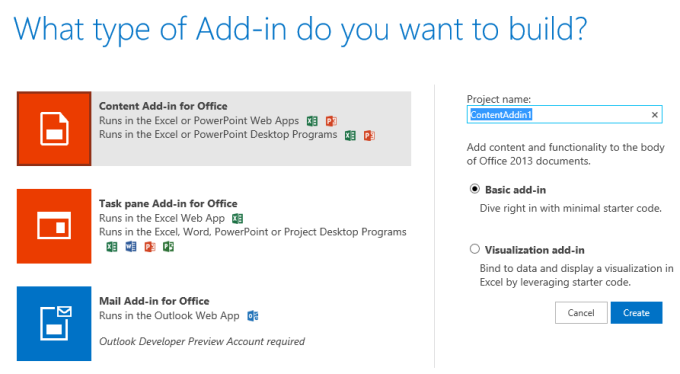

# Office Add-ins


An [Office Add-in](../../docs/overview/platform-overview.md) is a web application hosted in a browser control or iframe running in the context of an Office application. Add-ins can access data in the current document or mail item, and connect to web services and other web-based resources. To develop add-ins, you use web standards-based technologies, such as HTML5, JavaScript, CSS3, XML, and REST APIs. An add-in isn't actually installed on the computer running the Office host application; its implementation is hosted on a web server, so you can easily maintain and update it from that server.

You can create a simple Office Add-in by using Napa.

Here's what you need to do that:

- A [Microsoft account](http://www.microsoft.com/en-us/account/default.aspx)
    
- The URL for the [Napa Office 365 Development Tools](https://www.napacloudapp.com/ ) web app
    

## Create a basic add-in

1. Open the [Napa Office 365 Development Tools](https://www.napacloudapp.com/ ) web app in your browser.
    
2. Choose the  **Add New Project** tile.
    
     **Note:** The **Add New Project** tile appears only if you have created other projects. If this is your first project, skip to the next step.
    
    

3. Choose the kind of add-in you want to create, name the project, and then choose the  **Create** button.
    
    

    The code editor opens and shows the default webpage, which already contains some sample code that you can run without doing anything else.
    
4. On the side of the page, choose the Run button (
).
    
    The Office application associated with the kind of add-in you chose opens, and the sample add-in appears. You can now experiment with the features of the add-in.
    

## Next steps

Now that you've created your first add-in, see the following for some more in-depth examples:

- [Create a content add-in for Excel with Napa Office 365 Development Tools](../../docs/essentials/create-a-content-add-in-with-napa.md)
    
- [Create a task pane add-in with Napa Office 365 Development Tools](../../docs/essentials/create-a-task-pane-add-in-with-napa.md)
    
You can also use Visual Studio or a text editor to create Office Add-ins. To learn more, see the following:

- [Create a task pane or content add-in with Visual Studio](../../docs/essentials/create-a-task-pane-or-content-add-in-with-visual-studio.md)
    
- [Create a task pane or content add-in for Word or Excel by using a text editor](../../docs/essentials/create-a-task-pane-or-content-add-in-for-word-or-excel-by-using-a-text-editor.md)
    

## Additional resources

- [Submit Office and SharePoint Add-ins and Office 365 web apps to the Office Store](http://msdn.microsoft.com/library/ff075782-1303-4517-91cc-b3d730e9b9ae%28Office.15%29.aspx)
    
- [Provide feedback about the Office Developer Platform](http://officespdev.uservoice.com/)
    
- [Post a question in the Office Add-ins forums](http://social.msdn.microsoft.com/Forums/officeapps/en-US/home?forum=appsforoffice%2Cofficestore&amp;filter=alltypes&amp;sort=lastpostdesc)
    
